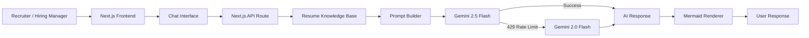
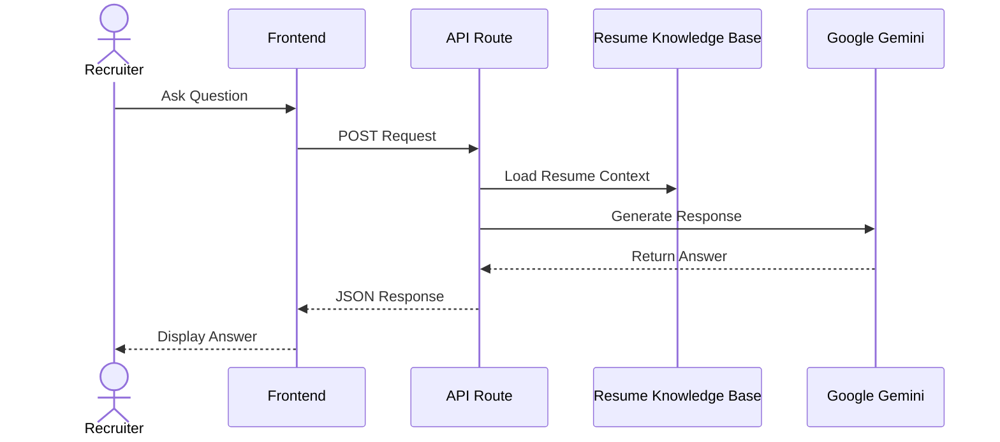

# 🚀 Siva D's AI Resume Chatbot

> An AI-powered recruiter assistant that transforms a traditional resume into an interactive conversational experience using Google Gemini, Next.js, and TypeScript.

<div align="center">


</div>

---

## 🌐 Live Demo

**Live Application**

👉 https://siva-ai-resume-chatbot.vercel.app

---

## 📖 Overview

Siva D's AI Resume Chatbot is a recruiter-focused AI portfolio platform that allows hiring managers, technical interviewers, and recruiters to interact with an intelligent assistant trained on verified professional experience, project accomplishments, technical expertise, certifications, and work authorization details.

Instead of browsing a static resume, visitors can ask questions naturally and receive contextual, recruiter-friendly responses.

### Example Questions

```text
Tell me about yourself.

What projects have you worked on?

Explain your Credit Union of Atlanta project.

How did you use Kafka?

What cloud platforms have you worked with?

What is your work authorization?

What rate are you expecting?

Show me an architecture diagram.
```

---

## ✨ Features

- 🤖 AI-powered resume assistant using Google Gemini
- 📚 Resume-grounded knowledge base
- 🏗️ Dynamic Mermaid architecture diagrams
- 🔄 Automatic Gemini model failover
- 🎙️ Voice-enabled chat support
- 📱 Fully responsive UI
- 📩 Recruiter contact integration
- 🔐 Privacy and security controls
- 🚀 Serverless deployment on Vercel

---

## 🏗️ Architecture



---

## 🔄 Request Flow



---

## 🛠️ Technology Stack

| Layer | Technology |
|---------|------------|
| Frontend | Next.js 15, React 19 |
| Language | TypeScript |
| Styling | Tailwind CSS |
| AI | Google Gemini |
| Backend | Next.js API Routes |
| Diagrams | Mermaid.js |
| Email | Nodemailer |
| Deployment | Vercel |

---

## 📂 Project Structure

```text
siva-ai-resume-chatbot/

├── app/
│   ├── api/
│   │   └── chat/
│   │       └── route.ts
│   ├── page.tsx
│   └── layout.tsx
│
├── src/
│   ├── components/
│   ├── data/
│   │   └── resumeKnowledge.ts
│   └── styles/
│
├── public/
├── .env.local
├── package.json
├── tsconfig.json
└── README.md
```

---

## ⚙️ Environment Variables

Create a `.env.local` file in the project root.

```env
GEMINI_API_KEY=your_gemini_api_key

GMAIL_USER=your_email@gmail.com
GMAIL_APP_PASSWORD=your_app_password
```

Required:

```env
GEMINI_API_KEY
```

Optional:

```env
GMAIL_USER
GMAIL_APP_PASSWORD
```

---

## 💻 Local Development

### Clone Repository

```bash
git clone https://github.com/sivad5712/Siva_Ai_Resume_Chatbot.git

cd Siva_Ai_Resume_Chatbot
```

### Install Dependencies

```bash
npm install
```

### Run Application

```bash
npm run dev
```

Open:

```text
http://localhost:3000
```

---

## 🚀 Deployment

The application is optimized for Vercel deployment.

### Required Environment Variable

```env
GEMINI_API_KEY=your_gemini_api_key
```

### Deploy

```bash
vercel --prod
```

---

## 🔒 Security Features

The chatbot prevents disclosure of sensitive information including:

- SSN
- Passport Numbers
- USCIS Numbers
- EAD Numbers
- Driver License Numbers
- Date of Birth

Sensitive requests automatically return privacy-safe responses.

---

## 📈 Engineering Highlights

### Resume Knowledge Engine

Structured knowledge repository containing:

- Professional Experience
- Project History
- Technical Skills
- Certifications
- Work Authorization
- Rate Expectations
- Architecture Diagrams

### Gemini Failover Strategy

Primary Model:

```text
gemini-2.5-flash
```

Fallback Model:

```text
gemini-2.0-flash
```

Automatically switches to the fallback model when rate limits occur.

### Interactive Architecture Visualization

Supports Mermaid.js diagrams directly inside chat responses for:

- System Design
- Microservices Architecture
- Cloud Infrastructure
- Event-Driven Systems
- Data Flow Visualization

---

## 📞 Contact

### Siva D

📧 Email: sivad5712@gmail.com

📱 Phone: +1 (614) 664-9498

💻 GitHub: https://github.com/sivad5712

🌐 Portfolio: https://siva-ai-resume-chatbot.vercel.app

---

## ⭐ Why This Project Matters

This project demonstrates practical expertise in:

- Full-Stack Engineering
- AI Integration
- Prompt Engineering
- Java & Spring Boot Ecosystem
- Microservices Architecture
- Cloud-Native Development
- API Design
- Vercel Deployment
- Modern Recruiter Experience Design

It serves as both a professional portfolio and a production-ready AI application showcasing modern software engineering practices.
