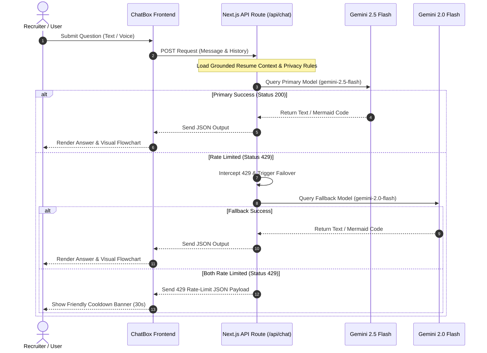

# Siva D's AI Resume Chatbot 🚀

[](https://siva-ai-resume-chatbot.vercel.app/)
[](https://nextjs.org/)
[](https://ai.google.dev/)
[](https://tailwindcss.com/)

A premium, state-of-the-art interactive **AI Resume Chatbot** designed to showcase the extensive software engineering background, architectural expertise, and enterprise domain depth of Siva D (Senior Software Engineer with ~8 years of experience building high-scale Java / Spring Boot systems, healthcare platforms, and financial software).

Recruiters and hiring managers can query this interactive system using text or speech-to-text voice inputs. The chatbot acts directly on Siva's behalf, answering in a warm, confident, and professional first-person tone, backed by real-time visualization of systems architecture.

> 🌐 **Live URL**: [https://siva-ai-resume-chatbot.vercel.app/](https://siva-ai-resume-chatbot.vercel.app/)

---

## 📸 Key Capabilities & Features

### 1. Robust Grounded AI Reasoning
* Powered by **Gemini 2.5 Flash** with an exhaustive professional context block containing verified experience, technical metrics, certifications, visa status, rate expectations, and recruiter references.
* Strict compliance logic: Never fabricates information, handles professional rates with flexibility, and protects sensitive PII (SSNs, Passport numbers, DOB) with a secure privacy blocker.

### 2. Visually Rendered Systems Architecture
* Automatically compiles and renders interactive **Mermaid.js** system design flowcharts inline directly inside the conversation bubbles when queried about architecture.
* Features clean interactive toolbar operations: **"Copy Code"** and **"Download as SVG"** for technical reviewers.

### 3. Seamless Model Failover (Quota Guard)
* Implements a smart multi-tier fallback architecture. If the primary model (`gemini-2.5-flash`) hits free tier rate limits (429), the server-side route seamlessly fails over to **`gemini-2.0-flash`** under a separate quota block to double daily capacity.
* Graceful error boundaries show a friendly, polite cooldown warning rather than a standard server crash.

### 4. Direct Recruiter Mail Dispatcher
* **Server-Side SMTP Delivery**: Processes recruiter queries directly to Siva's primary inbox (`sivad5712@gmail.com`) using high-performance server-side Nodemailer.
* **Smart Client-Side Fallback**: If SMTP is unconfigured locally, a custom Mailto button is dynamically rendered, pre-filling the recruiter’s native client with Siva's details so no message is ever lost.

### 5. Highly Responsive Premium UI/UX
* Renders a custom, transparent Glassmorphism design suspended over a responsive **3D Particle Mesh Background** powered by Three.js.
* Fluid animations designed using Framer Motion with comprehensive mobile touch overrides, input placeholder adaptations, and complete Light/Dark theme storage.

---

## 🗺️ Architectural Flow

The diagram below details the pipeline of a recruiter query traveling from the UI to the AI engine and the failover mechanism:



---

## 🛠️ Technology Stack

| Layer | Technologies Used |
| :--- | :--- |
| **Frontend Framework** | Next.js 15 (App Router), React 19, TypeScript |
| **Styling & Theme** | Tailwind CSS v4, Vanilla CSS, CSS Variables (Dark/Light mode) |
| **Generative AI** | Google Gemini API, `@google/generative-ai` SDK |
| **3D Rendering** | Three.js (WebGL particles/mesh) |
| **Dynamic Diagrams** | Mermaid.js, SVG parsing engine |
| **Animations** | Framer Motion (staggered cards, transitions) |
| **SMTP Delivery** | Nodemailer, Secure Gmail SMTP App Passwords |
| **Hosting & CI/CD** | Vercel, GitHub Actions |

---

## 💻 macOS Setup Guide

Follow these simple steps to run this project locally on your machine.

### Step 1: Install Node.js
Next.js requires Node.js (v18.0.0 or higher recommended).
1. **Using Homebrew**:
   ```bash
   brew install node
   ```
2. **Manual Installer**: Download the LTS installer directly from [nodejs.org](https://nodejs.org/).
3. Verify your installation:
   ```bash
   node -v
   npm -v
   ```

### Step 2: Clone and Install Dependencies
1. Open Terminal and navigate to the project folder:
   ```bash
   cd ~/Desktop/siva-ai-resume-assistant
   ```
2. Install the required Node packages:
   ```bash
   npm install --legacy-peer-deps
   ```
   *(Note: `--legacy-peer-deps` guarantees clean integration with React 19 package definitions).*

### Step 3: Setup Environment Variables
1. In the root of the project, create a secure local environment file:
   ```bash
   touch .env.local
   ```
2. Open `.env.local` and add the following keys:
   ```env
   # Google Gemini Credentials (Get free from https://aistudio.google.com/)
   GEMINI_API_KEY=your_actual_gemini_api_key_here

   # Email SMTP Credentials (Gmail App Password)
   GMAIL_USER=sivad5712@gmail.com
   GMAIL_APP_PASSWORD=your_gmail_app_password_here
   ```
   *(Note: `.env.local` is listed inside `.gitignore` to protect your secrets from ever being committed).*

### Step 4: Run the Local Dev Server
Start the Next.js server in development mode:
```bash
npm run dev
```
Open **[http://localhost:3000](http://localhost:3000)** in your browser to view and interact with the chatbot!

---

## 🚀 How to Deploy to Vercel (Production)

Deploy your portfolio to production globally in minutes:

1. Create a free account at [vercel.com](https://vercel.com).
2. Install the Vercel CLI globally:
   ```bash
   npm install -g vercel
   ```
3. Run the initial deployment from the project directory:
   ```bash
   vercel
   ```
4. **Configure Environment Variables**:
   * Navigate to your Vercel Project Dashboard.
   * Go to **Settings > Environment Variables**.
   * Add `GEMINI_API_KEY`, `GMAIL_USER`, and `GMAIL_APP_PASSWORD` with your real keys.
5. Publish live to production:
   ```bash
   vercel --prod
   ```

---

## 📞 Professional Contact Details

Siva is open to Contract, W2, C2C, and Full-Time engineering roles across the United States. 

* **Portfolio Website**: [siva-ai-resume-chatbot.vercel.app](https://siva-ai-resume-chatbot.vercel.app/)
* **Email**: [sivad5712@gmail.com](mailto:sivad5712@gmail.com)
* **Phone**: [+1 (614) 664-9498](tel:+16146649498)
* **GitHub Repository**: [github.com/sivad5712/Siva_Ai_Resume_Chatbot](https://github.com/sivad5712/Siva_Ai_Resume_Chatbot)
