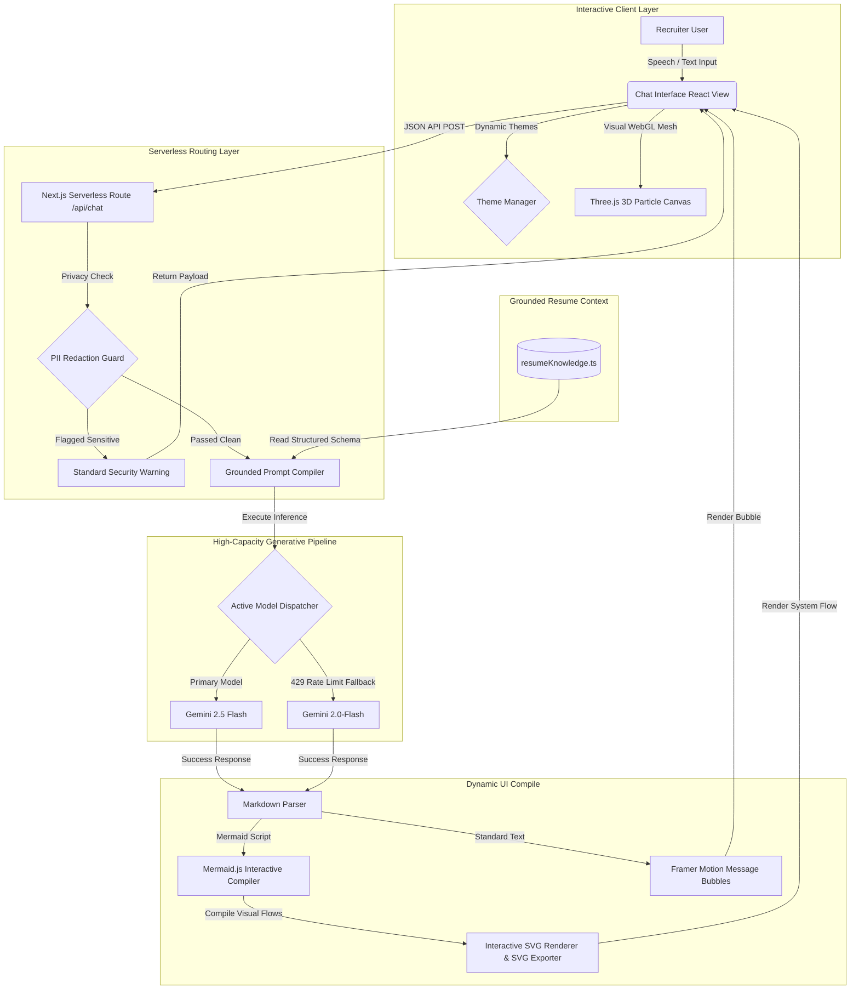
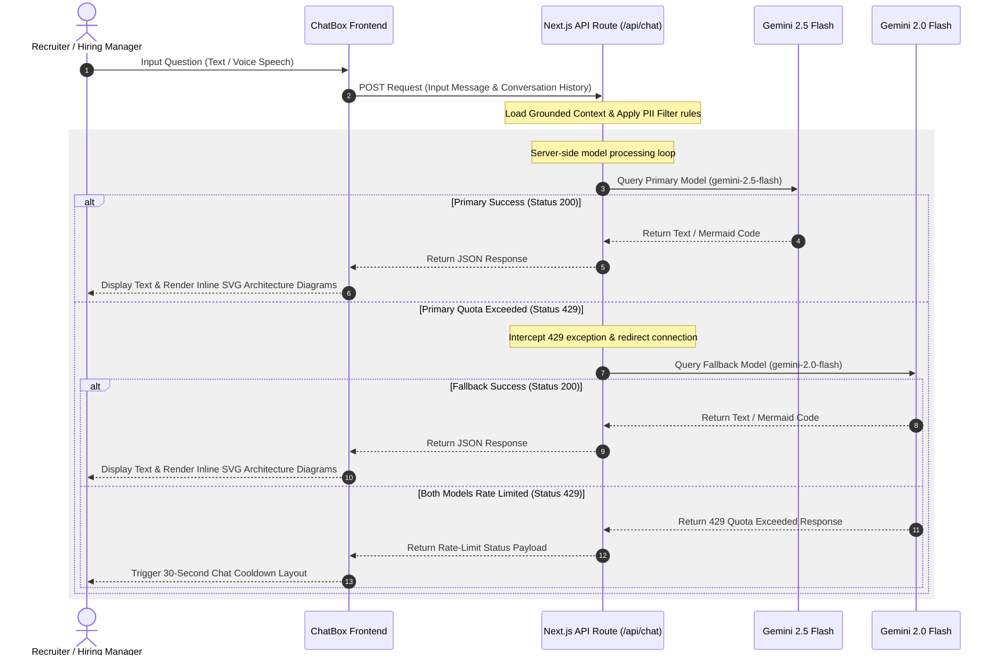

# 🚀 Siva D's AI Resume Chatbot

> An enterprise-grade conversational representative engineered to translate professional experience, system design methodologies, and domain depth into a high-speed interactive experience using Google Gemini, Next.js, and TypeScript.

<div align="left">


</div>

---

## 🌐 Live Demo

**Live Production Link**

👉 **[siva-ai-resume-chatbot.vercel.app](https://siva-ai-resume-chatbot.vercel.app)**

---

## 📖 Overview

Siva D's AI Resume Chatbot is an elite, recruiter-focused interactive portfolio platform that allows hiring managers, technical interviewers, and recruiters to converse naturally with an intelligent assistant trained on verified details of Siva's ~8 years of experience building high-scale Java / Spring Boot systems, HIPAA-compliant healthcare structures, and bank-grade fintech engines.

Rather than parsing a standard static document, recruiters can query this system via text or voice inputs to get grounded, accurate, first-person responses representing Siva.

### Example Inquiries

```text
Tell me about yourself.

What projects have you worked on?

Explain your Credit Union of Atlanta project.

How did you use Kafka?

What cloud platforms have you worked with?

What is your work authorization?

What rate are you expecting?

Show me an architecture diagram.
```

---

## ✨ System Capabilities

- 🤖 **Grounded AI Engine**: Google Gemini API model trained strictly on complete verified resume datasets.
- 🔒 **PII Protection Guard**: Real-time server-side filters block sensitive documentation numbers (SSN, Passports, EAD card IDs, DOB).
- 🔄 **Double-Quota Failover**: Automated server-side redirection from `gemini-2.5-flash` to `gemini-2.0-flash` on rate-limit exceptions (429 status) to double daily capacity.
- 🏗️ **Interactive Mermaid.js Renderer**: Detects architecture diagram requests and compiles visual flowcharts on the client-side with full SVG export tools.
- 🎙️ **HTML5 Voice Recognition**: Hands-free speech-to-text navigation using Web Speech Recognition.
- 📩 **SMTP Mailer & Mailto Fallback**: Multi-channel recruiter contact mechanism powered by server-side Nodemailer and client native mail redirection.
- 🌀 **Interactive 3D Graphics**: Responsive, high-performance WebGL particle mesh canvas powered by Three.js to provide an ambient, premium user experience.

---

## 🏗️ Technical Architecture

This flowchart outlines the decoupled layers of the chatbot system, illustrating the flow of data from the frontend client to the LLM backend routing tier:



---

## 🔄 Dynamic Request & Failover Cycle

This sequence diagram illustrates how a user inquiry is handled by the server, details the server-side privacy filtering, and demonstrates the automated failover sequence when the primary model encounters a quota rate limit:



---

## 🛠️ Technology Stack

| Component Layer | Technologies | Engineering Rationale |
| :--- | :--- | :--- |
| **Frontend Framework** | Next.js 15, React 19 | Provides high-speed React Server Components, server-side APIs, and efficient route compiling. |
| **Code Language** | TypeScript | Strong typings to enforce clean API boundaries and eliminate runtime execution errors. |
| **AI Processing** | Google Gemini SDK | Massive token context capabilities, structured prompting models, and extremely low latency. |
| **3D Animations** | Vanilla Three.js | Direct WebGL particle mesh animation delivering lightweight graphics without overhead. |
| **Flowchart Engine** | Mermaid.js SVG API | On-the-fly client compilation of fully styled diagrams directly from chat responses. |
| **UI Aesthetics** | Tailwind CSS v4, Vanilla CSS | Clean, minimal utilities optimized with custom CSS variables for light/dark theme persistence. |
| **Email Transport** | Nodemailer SMTP | Secure, server-side transactional email execution to bypass third-party dependencies. |
| **Hosting Infrastructure**| Vercel Engine | Low-latency globally edge-distributed serverless functions. |

---

## 📂 Project Structure

```text
siva-ai-resume-chatbot/
│
├── app/                        # Next.js App Router root
│   ├── api/
│   │   ├── chat/
│   │   │   └── route.ts        # Grounded LLM Route & Failover engine
│   │   └── contact/
│   │       └── route.ts        # Nodemailer SMTP mail endpoint
│   ├── page.tsx                # Main single-page interactive layout
│   └── layout.tsx              # SEO Metadata, font links, and theme provider
│
├── src/
│   ├── data/
│   │   └── resumeKnowledge.ts  # Verified structured resume database
│   └── styles/
│       └── globals.css         # Custom animations and dark/light modes
│
├── components/                 # Decoupled React Components
│   ├── ThreeBackground.tsx     # Three.js 3D WebGL particle mesh
│   ├── ChatBox.tsx             # Interactive voice/text chat controller
│   ├── DiagramRenderer.tsx     # Mermaid.js SVG flowchart compiler
│   └── ContactRecruiterForm.tsx# SMTP Form with pre-populated Mailto fallback
│
├── public/                     # Static assets (favicons, PDFs)
├── .env.local                  # Secure private local keys (Git-ignored)
├── package.json                # Project configurations & dependency versions
└── README.md                   # System Documentation
```

---

## ⚙️ Environment Variables

To run the application locally or prepare a production deployment, create a `.env.local` file in the root of the project:

```env
# Gemini AI Key - Secure for free at https://aistudio.google.com/
GEMINI_API_KEY=your_actual_gemini_api_key

# Nodemailer Credentials (Gmail SMTP configuration)
GMAIL_USER=your_email@gmail.com
GMAIL_APP_PASSWORD=your_secure_gmail_app_password
```

* **Required**: `GEMINI_API_KEY` (Powers the AI conversational logic)
* **Optional**: `GMAIL_USER` and `GMAIL_APP_PASSWORD` (Powers direct transactional recruiter mail dispatch; if absent, the application gracefully auto-triggers client-side native Mailto forwarding).

---

## 💻 Local Workspace Configuration

Follow these commands to clone, configure, and execute the repository on macOS:

### 1. Clone the Codebase
```bash
git clone https://github.com/sivad5712/Siva_Ai_Resume_Chatbot.git
cd Siva_Ai_Resume_Chatbot
```

### 2. Install Project Packages
```bash
npm install --legacy-peer-deps
```
*(Note: `--legacy-peer-deps` forces proper peer dependency resolutions with React 19 module frameworks).*

### 3. Launch Development Server
```bash
npm run dev
```
Open **[http://localhost:3000](http://localhost:3000)** in your browser.

---

## 🚀 Serverless Deployment

This repository is optimized for one-click global deployment using the Vercel Platform:

1. Install the Vercel terminal controller globally:
   ```bash
   npm install -g vercel
   ```
2. Initiate the Vercel setup sequence from your project root:
   ```bash
   vercel
   ```
3. Set your production keys (`GEMINI_API_KEY`, `GMAIL_USER`, `GMAIL_APP_PASSWORD`) in your **Vercel Dashboard under Settings > Environment Variables**.
4. Push live to production:
   ```bash
   vercel --prod
   ```

---

## 🔒 Security & Privacy Engineering

To ensure absolute confidentiality and block online scrapers, the chatbot features strict, regex-supported privacy filters inside the server-side router:

- **Redacted Information**: Automatically monitors and redacts SSN, EAD card details, Passport numbers, USCIS IDs, and birthdates.
- **Gracious Interception**: Returns a professional response inviting the recruiter to request required documentation during official hiring/background check onboarding:
  > *"For privacy and security reasons, I don’t share sensitive identity or immigration document numbers through this website. Siva can provide required documentation directly during official onboarding or background verification."*

---

## 📈 Technical Highlights & Grounding

* **Structured Grounding Context**: Programmed to base responses strictly on actual metrics, certifications (AWS, Spring Boot, etc.), and technologies listed in the structured knowledge file to eliminate AI hallucinations.
* **Warm First-Person Representation**: The LLM responds representing Siva in the first person ("I" or "Siva"), ensuring a friendly, recruiter-focused interview experience.
* **Flexible Salary/Rate Negotiations**: Configured to stay flexible around C2C/W2 contract expectations ($65/hr – $70/hr) and provide a clickable mobile link to call Siva directly at `+1 (614) 664-9498`.

---

## 📞 Professional Contact Details

Siva is open to Contract (W2/C2C), C2H, and Full-Time software engineering positions across the United States.

* **Email**: [sivad5712@gmail.com](mailto:sivad5712@gmail.com)
* **Phone**: [+1 (614) 664-9498](tel:+16146649498)
* **GitHub**: [github.com/sivad5712](https://github.com/sivad5712)
* **Interactive Chatbot Portfolio**: [siva-ai-resume-chatbot.vercel.app](https://siva-ai-resume-chatbot.vercel.app)

---

## ⭐ Why This Project Matters

This project demonstrates practical expertise in:

- Full-Stack Engineering
- AI Integration & Failover Strategies
- Prompt Engineering & Grounding Contexts
- Java, Spring Boot, & Enterprise Architecture
- Real-Time WebGL Graphics (Three.js)
- Responsive Mobile-First Design
- Cloud-Native Serverless Pipelines
- Microservices, Kafka Event Streaming, & System Design

It serves as both a high-fidelity interactive portfolio and a production-grade demonstration of modern software engineering practices.
